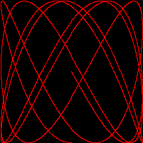

# LissajousCurves


Generates & serves dynamic Lissajous curve GIF via web app. Control cycles with URL http://localhost:8080/?cycles=10.

## 🚀 Running Lissajous via Docker


```
docker pull glaut0n/lissajous-golang:latest
docker run -p 8080:8080 lissajous-golang-app
```

Access and control the cycles by changing the numbers via URL:

```
http://localhost:8080/?cycles=4
```

